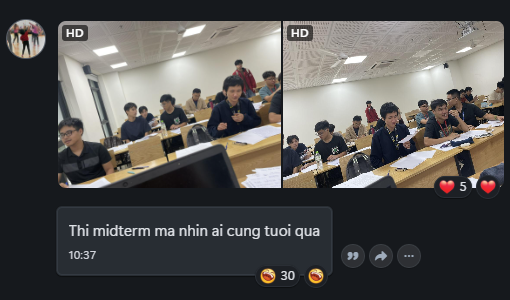

# PGS.TS. Phạm Phương Chi

> **“Em thế nào, cứ thế mà đến. Chớ loay hoay sửa soạn áo quần.”**  
> — **Rabindranath Tagore**, *The Gardener*, XI

**PGS.TS. Phạm Phương Chi (Chi P. Pham)** là Nghiên cứu viên chính tại **Viện Văn học, Viện Hàn lâm Khoa học xã hội Việt Nam (VASS)**, phụ trách **Phòng Văn học nước ngoài**. Cô có hai bằng tiến sĩ: **Tiến sĩ Lý luận văn học** tại Học viện Khoa học xã hội Việt Nam (2011) và **Ph.D. Văn học so sánh** tại University of California, Riverside (2016). Cô từng nghiên cứu sau tiến sĩ tại **University of Hamburg** với **học bổng Georg Forster của Quỹ Alexander von Humboldt**; theo CV cá nhân, thời gian nghiên cứu tại Hamburg được ghi là **03/2019–04/2023**. Cô được công nhận đạt tiêu chuẩn chức danh **Phó Giáo sư ngành Văn học năm 2023**.

## Thông tin cơ bản

- **Ngoại hình**: [Phạm Phương Chi][profile-image]
- **Lý lịch**: [Phạm Phương Chi][academic-profile]
- **Ngày sinh**: 14/01/1982
- **Giới tính**: Nữ 
- **Quê quán**: Văn Lang - Phú Thọ
- **Học vị cao nhất**: Tiến sĩ
- **Email**: chiphamvvh@gmail.com; phamphuongchi@gmail.com; cpham012@ucr.edu; cpham257554@troy.edu
- **Số điện thoại**: 0869903979
- **Zalo**: +4915211311099
- **Facebook**: [Facebook - Phạm Phương Chi][facebook-profile]
- **Website**: https://chivvh.wordpress.com/

## Các hướng nghiên cứu chính

Các hướng nghiên cứu chính của cô gồm:

* **Văn học Việt Nam và Đông Nam Á**
* **Văn học so sánh**
* **Phê bình hậu thuộc địa và các cách tiếp cận giải thực dân trong văn học so sánh**
* **Quan hệ giữa văn học, chủ nghĩa dân tộc và quá trình kiến tạo quốc gia**
* **Văn học và lý luận văn học Ấn Độ**, đặc biệt là sử thi, mỹ học cổ điển, văn học Anh ngữ và sự tiếp nhận văn học Ấn Độ tại Việt Nam
* **Phê bình sinh thái (ecocriticism) và nhân văn môi trường (environmental humanities)**
* **Nghiên cứu động vật (animal studies), quan hệ giữa con người và thế giới phi nhân loại**
* **Dịch thuật và nghiên cứu dịch thuật**

### Một số công trình tiêu biểu

* ***Literature and Nation-Building in Vietnam: The Invisibilization of the Indians*** — Routledge, 2021  
Chuyên khảo của **Chi P. Pham**.
* ***Reading South Vietnam's Writers: The Reception of Western Thought in Journalism and Literature*** — Springer, 2023  
Sách đồng biên tập với **Thomas Engelbert**.
* ***Environment and Narrative in Vietnam*** — Palgrave Macmillan, 2024  
Sách đồng biên tập với **Ursula K. Heise**.
* ***Humans and Other Animals: Animal Fiction from Vietnam*** — Penguin Random House SEA, 2024  
Đồng tác giả với **Chitra Sankaran**; tuyển tập gồm phần dẫn nhập phê bình và bản dịch chín truyện ngắn Việt Nam về động vật.
* ***Decolonizing Comparative Literature: Reading Across Southeast Asian Literatures*** — Springer, 2025  
Sách đồng biên tập với **Jose Monfred C. Sy** và **Nguyễn Thị Như Trang**.

## Lịch sử giảng dạy

- `ENG-2206` ([World Literature after 1660][eng-2206]): Summer-2026

## Đánh giá

### Chung

> **“师父，你怎么此时才来？来得好！来得好！救我出来，我保你上西天去也！”**  
> *“Sư phụ, sao đến tận bây giờ người mới tới? Tới thật đúng lúc, thật đúng lúc. Cứu ta ra, ta sẽ hộ tống người đến Tây Thiên.”*  
> — **Ngô Thừa Ân, *Tây Du Ký*, Hồi 14**

Buổi đầu tiên của môn ENG-2205 vào mùa hè 2025, Long có nói câu như này, đại ý là: một người thầy tốt là một người thầy giúp sinh viên tự học được, chứ không phải cứ theo kèm, chỉ giáo. Ban đầu tôi ngây thơ tin rằng việc đó là đúng, không thể ngờ được hậu quả lớn đến mức nào. Không thể ngờ rằng nguyên mùa hè đó, **“tay thực dân”** đã dùng lí do đấy để đô hộ tâm trí các sinh viên CS chúng tôi, những người mà chắc chắn sau mùa hè đó không phải những sinh viên nhân văn xuất chúng. Chúng tôi ở môn đó, tại đó, dù bị bắt ép, chỉ muốn được thảo luận, được *introduce* về các kinh điển của văn chương, đâu phải là học để trở thành những tay nhà văn, nhà thơ, đại văn hào.

Hồi học kinh tế vi mô, thầy Nguyễn Tài Vượng có nói một câu thế này: **“Phải có kiến thức mới thuyết trình được, còn không có thì bài thuyết trình là vô nghĩa.”** 10 tuần, 10 nhóm, vô nghĩa, cứ mỗi nhóm đọc tầm ba, bốn văn bản và lên thuyết trình; không đúng ý thì chửi, giờ ra chơi nào cũng bắt các nhóm lên để lão *tailor* cho đúng ý lão, cuối cùng vẫn không đúng là lên nói mấy câu để chốt lại cái hắn muốn. Chả nhẽ là muốn mượn công sức sinh viên để giết thời gian? Nếu thế thì chí ít cũng phải vứt cho cái gì có *insight* để đọc mới nói được chứ. À mà tôi xin lỗi vì mượn nơi đẹp đẽ như này để nói về lão. Cô Chi thì có lẽ không có gì để bàn nữa, nữ thần của em. Dấu ấn quan trọng là khi học với cô Chi, góc nhìn của chúng ta sẽ được tôn trọng hơn, kể cả nó có ngây thơ hay phức tạp, thứ mà Long cứ cố gắng uốn nắn trong vô vọng...

Trong văn bản *Tây Du Ký* (vốn được xem như là *The Odyssey* của Trung Quốc), sau một thời gian dài bị giam dưới Ngũ Hành Sơn, Tôn Ngộ Không đã rất vui mừng khi có người đến giải cứu mình khỏi sự kìm kẹp của ngọn núi. Cô Chi đến cũng vậy, lấp lánh ánh nắng chói lọi của mặt trời đang lên, một món quà, một sự giải thoát đối với các sinh viên Troy tại Hà Nội. Sinh viên giống như được giải phóng khỏi tay thực dân Long Le, khỏi sự khốn cùng mà khiến nhiều sinh viên suy nghĩ lại xem mình đóng tiền để nhận được điều gì từ trường đại học.

  
   
  <em>Hạnh phúc có nghĩa là gì?</em>
   
  <small>From: Pham Phuong Chi</small>

Hi vọng từ đây mở ra một tia hy vọng mới cho dù chỉ là một bộ phận hay sau này là đa số sinh viên Troy Hà Nội, những người đã bị kìm kẹp rất lâu, được sống trong hạnh phúc, được tôn trọng, được nói lên ý kiến của mình, được thoải mái trong tinh thần, và quan trọng nhất là được “học” thật sự.

### ENG-2206 - World Literature after 1660

> *Hiện tại chưa có dữ liệu cho phần này. Bạn có thể giúp cộng đồng Troy-IT bằng cách [đóng góp][contributing] thông tin qua Pull Request. 🙏🙏🙏*

## Chỉ số và sức mạnh

- **Điểm tổng kết trung bình gần nhất:** `?/100`
  
  - Độ lệch chuẩn: TBA
  
  - Tỉ lệ được A: TBA
    
    > *Hiện tại chưa có dữ liệu cho phần này. Bạn có thể giúp cộng đồng Troy-IT bằng cách [đóng góp][contributing] thông tin qua Pull Request. 🙏🙏🙏*
  
  

  
<i>Lịch sử điểm tổng kết</i>

  <blockquote markdown="1">
  
  - ENG-2206 - Summer-2026
    
    - **Điểm tổng kết trung bình:** `?/100`
      
      - Độ lệch chuẩn: TBA
      
      - Tỉ lệ được A: TBA
        
        > *Hiện tại chưa có dữ liệu cho phần này. Bạn có thể giúp cộng đồng Troy-IT bằng cách [đóng góp][contributing] thông tin qua Pull Request. 🙏🙏🙏*
  
  </blockquote>
  

- **Độ minh bạch và công bằng của tiêu chí chấm điểm:** `?/10`
  
  > *Hiện tại chưa có dữ liệu cho phần này. Bạn có thể giúp cộng đồng Troy-IT bằng cách [đóng góp][contributing] thông tin qua Pull Request. 🙏🙏🙏*

- **Độ bám sát bài học của đề thi:** `?/10`
  
  > *Hiện tại chưa có dữ liệu cho phần này. Bạn có thể giúp cộng đồng Troy-IT bằng cách [đóng góp][contributing] thông tin qua Pull Request. 🙏🙏🙏*

- **Độ hợp lí, cân bằng của khối lượng bài vở và sức khỏe tinh thần:** `?/10`
  
  > *Hiện tại chưa có dữ liệu cho phần này. Bạn có thể giúp cộng đồng Troy-IT bằng cách [đóng góp][contributing] thông tin qua Pull Request. 🙏🙏🙏*

- **Khả năng truyền đạt kiến thức và chuyên môn sư phạm:** `?/10`
  
  > *Hiện tại chưa có dữ liệu cho phần này. Bạn có thể giúp cộng đồng Troy-IT bằng cách [đóng góp][contributing] thông tin qua Pull Request. 🙏🙏🙏*

- **Tác phong, tính cách và mức độ hỗ trợ sinh viên:** `?/10`
  
  > *Hiện tại chưa có dữ liệu cho phần này. Bạn có thể giúp cộng đồng Troy-IT bằng cách [đóng góp][contributing] thông tin qua Pull Request. 🙏🙏🙏*

## Cơ chế trông thi

### Chung

> *Hiện tại chưa có dữ liệu cho phần này. Bạn có thể giúp cộng đồng Troy-IT bằng cách [đóng góp][contributing] thông tin qua Pull Request. 🙏🙏🙏*

### ENG-2206 - World Literature after 1660

> *Hiện tại chưa có dữ liệu cho phần này. Bạn có thể giúp cộng đồng Troy-IT bằng cách [đóng góp][contributing] thông tin qua Pull Request. 🙏🙏🙏*

## Tips

### Chung

> *Hiện tại chưa có dữ liệu cho phần này. Bạn có thể giúp cộng đồng Troy-IT bằng cách [đóng góp][contributing] thông tin qua Pull Request. 🙏🙏🙏*

### ENG-2206 - World Literature after 1660

> *Hiện tại chưa có dữ liệu cho phần này. Bạn có thể giúp cộng đồng Troy-IT bằng cách [đóng góp][contributing] thông tin qua Pull Request. 🙏🙏🙏*

## Trivia

> *Hiện tại chưa có dữ liệu cho phần này. Bạn có thể giúp cộng đồng Troy-IT bằng cách [đóng góp][contributing] thông tin qua Pull Request. 🙏🙏🙏*

[profile-image]: https://i.imgur.com/tIV2wJQ.jpeg
[academic-profile]: https://scholar.google.com.au/citations?user=BEytnnYAAAAJ&hl=en
[facebook-profile]: https://www.facebook.com/profile.php?id=100003199839986
[eng-2206]: ../ENG-2206/
[contributing]: ../CONTRIBUTING.md
