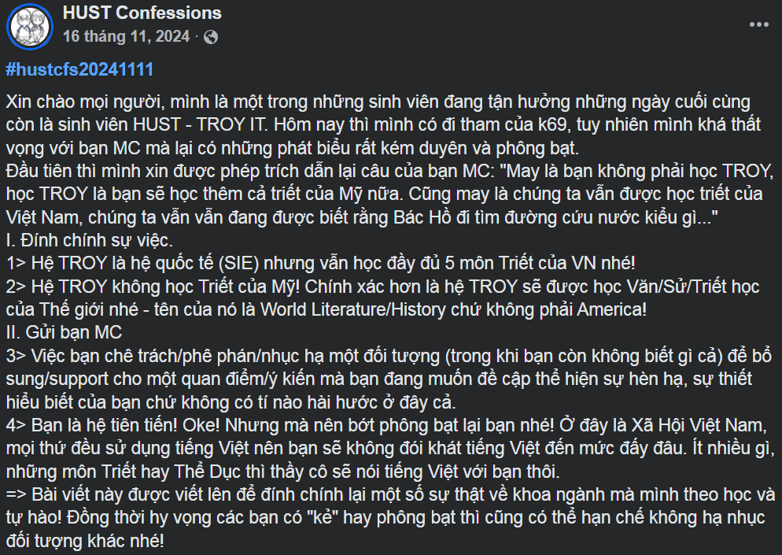

## Why???

- Ủa sao lại có folder này? Tưởng Troy mình không học Triết?
  
  

    <video src="https://github.com/user-attachments/assets/981d3277-b32d-4bfa-8d7e-00b9acaedb6a" controls style="max-width:100%; height:auto;"></video>
  

- [Công bố](https://www.facebook.com/share/p/1EzToj6v5N/):

  

    
  

- Thôi, nói này: các môn lý luận chính trị (5 môn Triết) ở trường là bắt buộc phải hoàn thành mặc dù các môn đó không tính vào GPA của Troy nhưng mà là điều kiện đủ để bằng Troy được công nhận tại Việt Nam (thực ra là ĐHBKHN thích thế, không học tớ giam bằng). Còn trường hợp chuyển tiếp thì không nói làm gì.

## What to do?

- Quá trình đăng ký sẽ được diễn ra như sau:
  1. Đăng ký học phần
    - Đây là lúc sinh viên đăng ký những môn mà mình muốn học cho những kì tiếp theo.
    - Nếu như số lượng sinh viên đăng ký học phần đủ lớn thì trường mới mở lớp để có thể đăng ký.
  2. Đăng ký lớp
    - Đây là lúc đăng ký để chọn lớp. Lúc này sẽ biết lịch của từng lớp và sinh viên có thể chọn.
    - Đăng ký lớp sẽ chia ra làm 3 đợt:
      - Đăng ký chính thức: Đây là lúc sinh viên có thể đăng ký những môn mà sinh viên đã đăng ký học phần
      - Đăng ký điều chỉnh: Tất cả sinh viên đều có thể đăng ký, kể cả nếu như sinh viên chưa đăng ký học phần môn đó
      - Đăng ký thêm: (Chưa có quy trình rõ)

### Đăng ký học phần

- Sinh viên cần theo dõi lịch mở đăng ký học phần, và vào đăng ký khi hệ thống mở.
  - Thường sẽ có thông báo qua Teams và Outlook, nhưng nếu không có, sinh viên nên chủ động check: https://ctt.hust.edu.vn/DisplayWeb/DisplayListKeHoach?tag=%C4%90T%C4%90H

- Khi hệ thống đăng ký học phần mở, sinh viên đăng nhập vào: https://ctt-sis.hust.edu.vn/ và đăng ký học phần trong đó.
  - Lưu ý rõ kì muốn đăng ký: ví dụ, kì xuân 2026 sẽ có mã học kì là 20252 (chứ không phải 20261).
    - Mã học kỳ của kì xuân: <năm trước>2 (Ví dụ: Xuân 2026 sẽ có mã học phần là 20252)
    - Mã học kỳ của kì hè: <năm trước>3 (Ví dụ: Hè 2026 sẽ có mã học phần là 20253)
    - Mã học kỳ của kì thu: <năm nay>1 (Ví dụ: Thu 2026 sẽ có mã học phần là 20261)

- Những học phần mà sinh viên phải học để có thể tốt nghiệp là (chú ý đăng ký mã học phần có chữ Q ở cuối, đăng ký nhầm là có học cũng không được tính vào điều kiện):
  - SSH1111Q (Triết học Mác - Lênin)
  - SSH1121Q (Kinh tế chính trị Mác - Lênin)
  - SSH1131Q (Chủ nghĩa xã hội khoa học)
  - SSH1141Q (Lịch sử đảng cộng sản Việt Nam)
  - SSH1151Q (Tư tưởng Hồ Chí Minh)

- Đăng ký học phần không mất tiền, và sinh viên không bắt buộc phải đăng ký lớp của những học phần sinh viên đã đăng ký, nên lựa chọn tốt nhất luôn là đăng ký tất cả học phần mà sinh viên chưa học. **Tất cả**.

### Đăng ký lớp

- Cũng như trên, sinh viên cần theo dõi lịch mở đăng ký lớp, và vào đăng ký khi hệ thống mở, thường là nhiều tuần sau khi đã đăng ký học phần.

- Khi hệ thống đăng ký lớp mở, sinh viên đăng nhập vào: https://qldt.hust.edu.vn/
  - Sau đó vào mục đăng ký lớp: https://qldt.hust.edu.vn/students/learn/class-registration rồi đăng ký những lớp sinh viên muốn học.

(Mang tiếng trường công nghệ số 1 VN mà làm quả web khá rác, thường lúc hệ thống mở cái là sập, nên sinh viên sẽ phải ngồi đợi canh refresh tầm vài tiếng để không bị lỡ mất xuất đăng ký (vì hết slot rất nhanh))

## How to study???

- Các môn này là môn của BK, không giống như môn của Troy, vì thế chỉ cần đạt ở *ngưỡng qua môn* là được.
- *Ngưỡng qua môn* nghĩa là sao? Nôm na là phải đạt **ít nhất 3đ cuối kỳ**, vậy thôi 😀. Còn điểm quá trình thì đi học một vài buổi, làm thuyết trình, giữa kỳ chép chép tí là được.
- Cuối kỳ thì bắt phao rất ác, cũng tùy phòng, có nơi trông dễ. Thường thì môn nào cũng có **phím sẵn** các câu sẽ được ưu tiên ra thi, nên cố gắng là học hết, hoặc không học gì cả rồi vào chép tầm 3đ là kê cao gối ngủ ngon.
- Học phí: **free**.

## Where to go???

- [CLB Hỗ trợ Học tập Bách khoa](https://www.facebook.com/clbhthtbk)

- [Tài liệu HUST](https://tailieuhust.com/)

## Tips

- Bắt đầu học càng sớm càng tốt, lúc mà chưa học nhiều môn chuyên ngành nặng. Ngay từ năm nhất luôn cho nhẹ đầu. Không cứ trì hoãn sau phải nhồi nhét mấy môn một kỳ lại hối hận.
