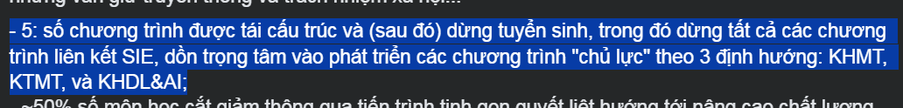
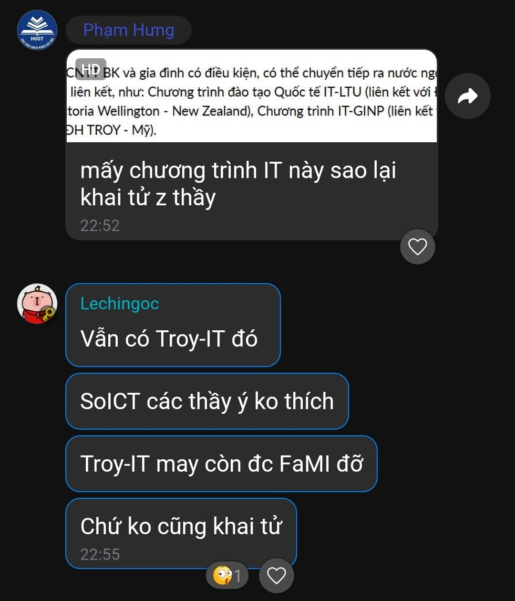
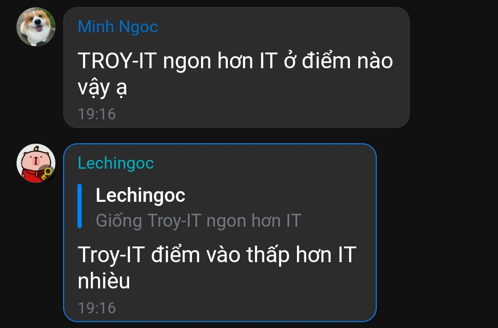
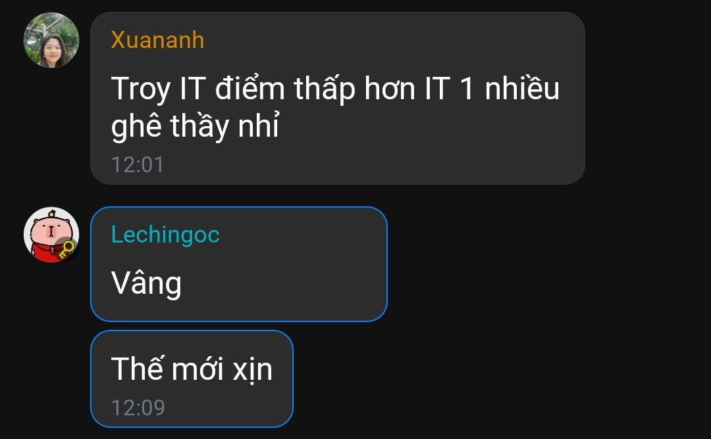

# Tổng hợp một số thông tin về ngành

> Khát khao biết được sự thật chính là thứ đã đẩy con người khỏi vườn địa đàng.

## *Old hat*

Ở góc độ lập trình, *stale data* là dữ liệu đã cũ, không còn phản ánh trạng thái hiện tại của hệ thống, nhưng vẫn bị một đoạn code sử dụng. Tương tự như vậy, tôi nhận thấy ngành ta cũng đang trải qua một thời kỳ cũng gọi là 'Kỷ nguyên vươn mình'. Vì thế, các giáo viên, cách dạy, cách thi... thay đổi nhanh chóng và chắc chắn sẽ có những 'dữ liệu lỗi thời': nó được viết trong một context khác, khi cảm xúc và bối cảnh chưa thay đổi. Do vậy, tôi nhận thấy cũng cần phải refer tới một nơi mà một vài thông tin có phần latest hơn.

**PRESS ME**: [][28]

## Cái Tát Của Thực Tế

- Về khối lượng học của Troy và BK:
  
  |                   |                                 Troy                                  |                                           BK                                            |
  | :---------------: | :-------------------------------------------------------------------: | :-------------------------------------------------------------------------------------: |
  | Tính chất môn học |  Hầu hết các môn quan trọng đều có project (Required Major Courses)   |                                  Chủ yếu là lý thuyết                                   |
  | Đồ án tốt nghiệp  | Không, thay vào đó là các project xuyên suốt, học đủ tín là ra trường |  Có, đồ án chính là một phần mà các đại học VN chịu ảnh hưởng từ nền giáo dục Liên Xô   |
  |  Điểm 'qua môn'   |                     Thường là 6 hoặc 7 điểm tổng                      | Thường là 3 điểm cuối kì đổ lên (mức 3 điểm cuối kì ở Troy coi như chả qua được môn gì) |

- Thực ra tự nhiên mà làm một cái so sánh giữa Troy và BK ở đây là tôi thấy hơi sai trái về mặt đạo đức 🙂, thực ra tôi không muốn so sánh như vậy, tôi bị f... Dù không muốn nhưng mà cũng không thể bỏ qua được vì nó chứa thông tin có thể hữu ích nên không bỏ được, nhưng mà để mà thành thật thì đừng mang tư duy so sánh giữa ngành ta và phần còn lại (BK), so sánh này thực ra là mang tính *vuốt ve peter* của một số người muốn làm bảng so sánh này thôi, *thẩm du tinh thần* ấy!! Chứ mình học thật sự là nhẹ hơn BK cũng đáng kể đấy, không có cửa mà so với BK đâu nhé... Lấy một ví dụ mà tôi coi là cái gốc của mọi ngành, Toán nhé? Chúng ta nhìn thẳng vào cái môn Toán đầu tiên mà được học tại Troy ấy ([MTH-1112](../MTH-1112/README.md)), đấy là cách BK tiến hành một môn học, đi thi là không mang cái gì vào (ngoài 🧠), vào ngồi thi căng - thầy sẵn sàng var thẳng đứa nào nhờn (những cái này tôi đã nói kĩ hơn trong link ở cái mở ngoặc tên môn kia), đấy môn đấy đơn giản vậy đã trượt 1 đống rồi, giờ mà giả sử đống Toán còn lại ở Troy mà cũng tiến hành như thế hoặc cứ vài môn như thế thì chắc *chết như ngả rạ* chứ đùa đâu. 🥳🥳

## Counting Method

- Suy nghĩ về các môn Toán của Troy (**không đam mê có thể bỏ qua**). Đến thời điểm hiện tại thì tôi đã hoàn thành hầu hết cơ bản các môn Toán của Troy, Toán ở đây theo nghĩa mà tôi **tự định nghĩa**, theo tôi các môn sau cũng là môn Toán, không mang mã MTH: CS-2220 (Phương pháp Tính), CS-3372 (Lý thuyết Tính toán). Tôi băn khoăn mãi không biết vấn đề nào là khó nhất của Toán ở Troy? Mãi đến gần đây khi tiếp cận *đề thi môn Toán thi tốt nghiệp THPT 2025*, tôi mới nhận ra, có lẽ vấn đề khó nhất với anh em học try hard Toán có lẽ là Counting Method hay bài toán đếm, là một phần nhỏ của Toán Rời Rạc và XSTK, theo tôi đây là bài toán khó, vì một khi đếm sai là các công thức sử dụng kết quả trực tiếp từ việc đếm đó chắc chắn sai, còn các vấn đề còn lại thực ra cũng không khó lắm, chỉ cần tập trung xíu là học ổn. Nên hãy chú ý về bài toán đếm để tối ưu điểm A nhé!!       

## Chí Phèo và làng ... Bách Khoa??

> "Hắn vừa đi vừa chửi. Bao giờ cũng thế, cứ rượu xong là hắn chửi. Bắt đầu hắn chửi trời. Có hề gì ? Trời có của riêng nhà nào ? Rồi hắn chửi đời. Thế cũng chẳng sao : đời là tất cả nhưng chẳng là ai. Tức mình, hắn chửi ngay tất cả làng Vũ Đại. Nhưng cả làng Vũ Đại ai cũng nhủ : “Chắc nó trừ mình ra !”. Không ai lên tiếng cả."  
> — [*Nam Cao, Chí Phèo*](./Assets/Books/Ngu-Van-11-Tap-1.pdf)

Chắc hẳn chúng ta không còn xa lạ với tác phẩm Chí Phèo của nhà văn Nam Cao, được in trong sách giáo khoa Ngữ văn lớp 11, tập một, thuộc Chương trình giáo dục phổ thông năm 2006. Có thể nói rằng bi kịch bị ruồng bỏ của Chí Phèo là bi kịch tinh tế của một con người sinh ra làm người nhưng không được làm người. Tiếng chửi là tiếng kêu thương của sự tuyệt vọng, là chứng tích đau đớn cho một số phận bị xã hội đào thải, cô lập, không nơi nương tựa (SIE → SoICT → Phòng Đào Tạo → FaMI).

- Về vấn đề điểm đầu vào của Troy: có lẽ do hệ thống các ngành quá đa dạng và học phí thấp hơn rất nhiều của BK mà Troy có phần lạc lõng trong danh sách điểm chuẩn các ngành hằng năm (xếp cuối nơi mọi người ít quan tâm), kèm theo đó ở giai đoạn trước điều kiện IELTS cũng là một điều kiện khá khó khăn đối với học sinh cấp 3, ít người dám vào. Những năm gần đây do bùng nổ xét tuyển chứng chỉ ngoại ngữ quốc tế mà càng nhiều học sinh có chứng chỉ IELTS hơn thành ra cũng đông người chọn ngành Troy hơn, tuy vậy, việc điểm đã thấp từ trước do ít người vào đã tạo thành một **tiền lệ xấu** nên sau này điểm cứ thấp theo dòng thời gian, nhiều SV Troy vào Troy vì đây là 'lốp dự phòng', một điều đáng buồn!! Một lí do nữa đáng để nói tới là việc Troy không được giới chóp bu tại BK đẩy mạnh quảng bá nên cũng ít người biết về sự tồn tại của Troy BK, mà biết thì chưa chắc đã tin với quả điểm chuẩn vậy, *một vòng luẩn quẩn*.
  
  - Năm 2024, có lẽ là một năm bước ngoặt, mà chả biết có lợi cho ngành hay không khi có hai thứ đã thay đổi: 1 là việc tăng 50% chỉ tiêu tuyển sinh (80 → 120), 2 là việc 'hardcode' điều kiện chứng chỉ ngoại ngữ vào trong đề án tuyển sinh đối với ngành Troy. Việc thứ 2 phải nói là một điều tốt vì giờ khi vào tất cả đã đạt điều kiện chứng chỉ, nên sẽ không có kiểu lớp nợ chứng chỉ (lớp B) và lớp đã có (lớp A) nữa, mọi người được đồng bộ, một số môn lớp A phải đợi lớp B sang đầu năm 2 thì mới học cùng thì giờ đây có thể cùng nhau học từ năm 1 => đồng bộ, thông suốt, liền mạch. Tuy vậy một vấn đề thì thường có hai mặt đối lập, thay đổi thứ 2 là một mặt tốt, còn mặt đầu tiên thì thực sự không có lợi cho ngành lắm vì ngành đang ít sinh viên, do chạy theo nhu cầu xã hội về ngành IT mà tăng chỉ tiêu ngành khiến cho điểm chuẩn lại càng kéo xuống (**21đ** 2024) khiến cho năm này trở thành một năm thảm về mặt điểm chuẩn ngành, đối cứng của thay đổi tốt đẹp...

- Sau Đại hội Đảng bộ Trường Công nghệ Thông tin và Truyền thông, thầy [Tạ Hải Tùng](https://soict.hust.edu.vn/pgs-ts-ta-hai-tung.html) có đăng [status](https://www.facebook.com/share/p/1LiP7Rbcxg/) nói về kết quả nhiệm kỳ, trong những con số ấy có một thông tin mà tôi thấy hết sức là thú vị: 
  
  

    
  

  
  Và chúng ta cũng nằm trong số 'được tái cấu trúc và (sau đó) dừng tuyển sinh' đấy, cũng may là 'được FaMI đỡ' không thì giờ mọi người đã không ở đây để đọc cái này :)))
  
  

    
  

## *All that glitters is not gold.*

Nói nhiều quá, thế ưu điểm ngành mình là gì? ... Là:

  

  

Tóm lại:

  

## Xếp Hạng Bằng Đại Học

- Cấp độ của bằng ở Troy, ở Troy không chia bằng kiểu khá, giỏi mà chia kiểu:
  
  - Cum Laude (**with honor**): Grade point average of 3.40
  
  - Magna Cum Laude (**with great praise/distinction**): Grade point average of 3.60
  
  - Summa Cum Laude (**with highest praise/distinction**): Grade point average of 3.80

## Humanity of Troy University

|          Tiêu chí          | Troy                                                                                                                                                                                                                                     | BK                                                                                                                                                                    |
| :------------------------: | ---------------------------------------------------------------------------------------------------------------------------------------------------------------------------------------------------------------------------------------- | --------------------------------------------------------------------------------------------------------------------------------------------------------------------- |
|  Ngưỡng cảnh báo học tập   | - Institutional GPA < 2.00 → Academic Probation. - Nếu đang probation mà Institutional GPA của kỳ tiếp theo < 2.00 → Academic Suspension.                                                                                            | - Nợ > 8 tín chỉ/học kỳ → +1 mức cảnh báo. - Nợ > 16 tín chỉ/học kỳ hoặc bỏ học/không đăng ký → +2 mức cảnh báo. - Nợ tích lũy > 24 tín chỉ → Cảnh báo mức 3. |
| Tăng mức cảnh báo/đình chỉ | - Suspension lần 1: đình chỉ 1 kỳ. - Lần 2: đình chỉ 2 kỳ. - Lần 3: đình chỉ vô thời hạn.                                                                                                                                        | - Nợ tín chỉ nhiều hơn theo ngưỡng sẽ nâng cảnh báo. - Có thể nâng 1 hoặc 2 mức tùy mức độ.                                                                       |
|       Buộc thôi học        | - Với B.S.B.A: một môn business chỉ được thử tối đa 3 lần (điểm D coi là đậu nếu không yêu cầu cao hơn). Nếu không đạt sau 3 lần → buộc thôi học khỏi ngành/chuyên sâu đó. - Sinh viên CS thì không có yêu cầu gì lạ hơn để bị đuổi. | - Bị cảnh báo mức 3 hai lần liên tiếp. - Học chậm quá thời hạn cho phép hoặc không còn khả năng tốt nghiệp đúng hạn.                                              |

### Một số bổ sung

- Sinh viên có 8 năm kể từ khi lần đầu nhập học tại Đại học Troy để hoàn thành yêu cầu tốt nghiệp theo chương trình học (catalog) ban đầu.

- Nếu học lâu hơn 8 năm, bạn sẽ bị chuyển sang chương trình học hiện hành, nghĩa là phải đáp ứng các yêu cầu mới/cập nhật. → cơ bản là không bị đuổi.

- Nếu không theo học tại Troy trong 2 năm liên tiếp, khi quay lại bạn phải tuân theo yêu cầu của chương trình học hiện hành tại thời điểm tái nhập học (giống như sinh viên mới). → chưa phải là đuổi, chỉ là không học thôi.

Troy: chúng ta có thể dễ dàng thấy được rằng với BA thì Troy có vẻ quy định chặt chẽ hơn nhiều so với CS, vì có 1 sự thật là Troy là trường chuyên về Kinh tế, Giáo dục hơn là CS.

BK: chính sách của BK phản ánh sự chú trọng vào khả năng hoàn thành tiến độ học tập, khả năng có thể 'theo được' hơn là kéo dài lê la, và họ cũng không muốn support những người học lâu dài cho lắm.

Ta thấy được rằng: Troy có phần 'nhân đạo' hơn trong chính sách về việc 'đuổi học' này. Cũng như nhiều đại học của Mỹ, họ chú trọng, đề cao sự kiên trì, hoàn cảnh cá nhân, và quan điểm rằng sinh viên có thể tiến bộ nếu được giúp đỡ hơn là tư duy 'tao tin chắc mày không theo tao được nữa' của VN. VN cũng có phần chịu cái ảnh hưởng từ các giá trị Nho giáo truyền thống - **học hành là con đường quan trọng để đạt thành công cá nhân và gia đình**.

→ *Thế giờ mày học đến 8, 9 thậm chí là 10 năm thì còn giúp ích gì cho xã hội nữa.* 😀

Mỹ thì kiểu: sinh viên/người học không đơn giản bị nhìn nhận như 'một sản phẩm lỗi' cần loại bỏ, mà như một **cá nhân có tiềm năng phát triển nếu được hỗ trợ đúng cách**. Kể cả bất kì cái stage nào trong đời họ, một khoảnh khắc họ đạt được cái thành công học tập cũng là đóng góp đáng kể cho ý nghĩa về con người, về xã hội lâu dài.

→ *Không để ai bị bỏ lại phía sau.* (đôi khi là triết lý phổ biến của người Việt nhưng đôi khi thì cũng không đúng lắm!)

[28]: https://docs.google.com/spreadsheets/d/1oul8eulWa2AUBCTdiUvRLsjWuMT-cb56-ox9cfm0llU/edit?usp=sharing
